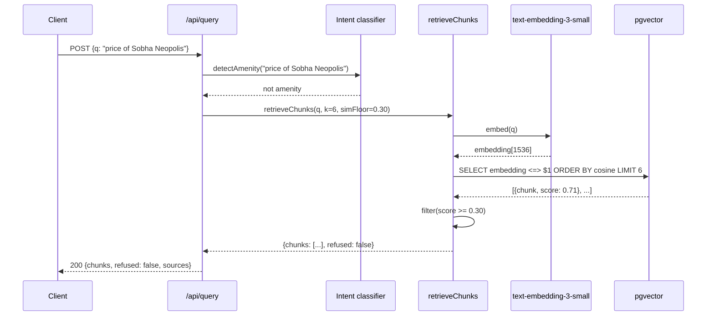
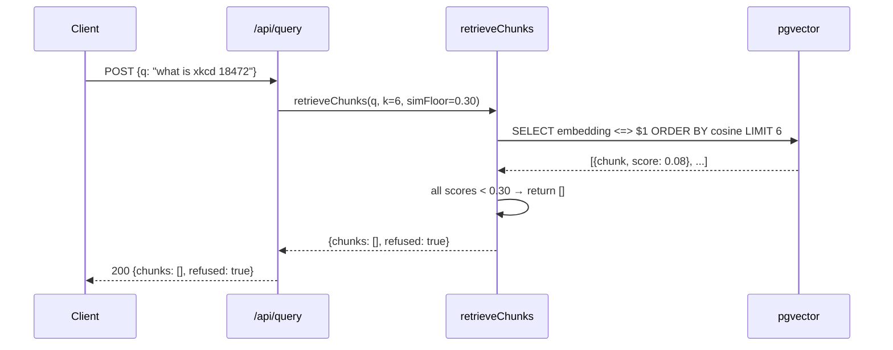

# Architecture — Anchor

> Detailed architecture: [docs/architecture.md](docs/architecture.md)

## Component diagram

```mermaid
graph TB
    subgraph Client
        UI[app/playground<br/>Query UI]
    end

    subgraph "Anchor Service"
        API[/api/query<br/>POST]
        Intent[Intent classifier<br/>detectAmenity]
        Retriever[Retriever<br/>retrieveChunks]
        Embedder[OpenAI<br/>text-embedding-3-small]
    end

    subgraph Storage
        PG[(Postgres<br/>+ pgvector)]
        Emb[(Embeddings)]
    end

    UI --> API
    API --> Intent
    Intent --> Retriever
    Retriever --> Embedder
    Embedder --> PG
    PG --> Retriever
    Retriever --> API
    API --> UI

    classDef storage fill:#fef3c7,stroke:#ca8a04
    classDef defense fill:#fee2e2,stroke:#dc2626
    classDef happy fill:#dcfce7,stroke:#16a34a
    class PG,Emb storage
    class Retriever defense
    class Embedder,Intent happy
```

## Request sequence — grounded query



## Request sequence — refused query



## Module map

| Module | File | Purpose |
|---|---|---|
| API handler | `src/app/api/query/route.ts` | POST /api/query — embeds, retrieves, returns chunks or refusal |
| Retriever | `src/lib/rag/retriever.ts` | Core retrieval: embed query → pgvector → filter by floor → return |
| Embed-writer | `src/lib/rag/embed-writer.ts` | Per-entity upsert functions: chunkForProject, chunkForBuilder, etc. |
| Demo seeder | `src/lib/rag/demo-seeder.ts` | Seeds public-domain docs into the vector store |
| Seed runner | `src/lib/rag/seed-runner.ts` | Orchestrates multi-entity embedding runs |
| Prisma client | `src/lib/prisma.ts` | Singleton Prisma client for Next.js |

## Key design decisions

1. **Cosine floor instead of top-K only** — Most RAG uses top-K and passes whatever comes back to the LLM. Anchor adds a similarity floor (0.30 default). Below that, the retrieval is too weak to be useful, and we return `refused: true`. This prevents hallucination on weak retrieval signals.

2. **Adaptive K for amenity queries** — Amenity queries ("schools near Bopal") have more variation in text, so cosine scores are lower even for relevant items. Amenity queries use K=10 + floor=0.20 instead of K=6 + floor=0.30. This is in `retriever.ts:detectAmenity → use case`.

3. **Idempotent upsert on (entityType, entityId)** — The backfill script can be re-run safely. Every embed function uses Prisma `upsert`, not `create`. Unique constraint prevents duplicates. Re-running produces the same result as running once.

## Retrieval timeout

600ms hard cap in `retriever.ts`. If pgvector doesn't respond within 600ms, returns `[]` with `refused: true`. Caller handles gracefully. The `700` constant is checked before returning; on timeout, the function catches the error and returns the empty refused response.