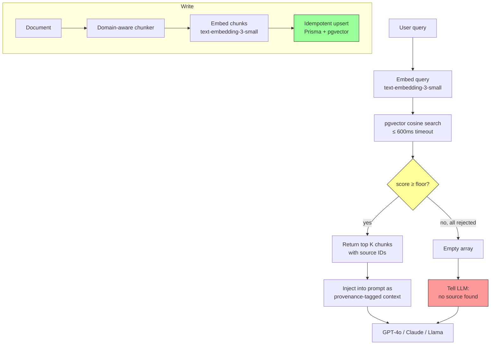

# Anchor

**Provenance-first RAG that refuses to hallucinate.**

[](https://github.com/ykstorm/anchor/actions/workflows/ci.yml)
[](https://hub.docker.com/r/ykstorm/anchor)
[](LICENSE)
[](https://anchor.lakshyaraj.dev)

> Live demo: **[anchor.lakshyaraj.dev](https://anchor.lakshyaraj.dev)** — ask anything about a small public-domain corpus (Project Gutenberg). Watch what happens when no chunk crosses the cosine floor: Anchor refuses instead of inventing.


---

## Why Anchor exists

Most RAG tutorials show you the happy path: embed, retrieve top-K, stuff into the prompt, watch the model answer.

The unhappy path is where production breaks. The retriever returns a top-K that has nothing to do with the query (cosine 0.18, 0.21, 0.17), the LLM still synthesizes a confident answer using only its priors, and your users see hallucination dressed up as citation. This is the OTP-simulation pattern, the fabricated-founding-year pattern, the "we have an SBI escrow account" pattern. Real bugs from real production traffic on [Homesty.ai](https://homesty.ai) (commission real-estate AI).

Anchor is the productized version of the retrieval layer that fixed those bugs. **Provenance-first**: every chunk that enters the prompt has a source ID. Every assertion the LLM makes can be traced back. When no chunk crosses the cosine floor, the LLM is told it has no source — and refuses to answer. No invented founding years. No fake escrow. No "based on my training data" smuggled in.

---

## What makes Anchor different

| | Anchor | LangChain RAG | LlamaIndex | Naive vector DB |
|---|---|---|---|---|
| Cosine floor (drop low-similarity matches) | ✅ 0.30 default, tunable | ❌ | ❌ | ❌ |
| Adaptive K per query intent | ✅ 6 normal, 10 amenity | ❌ | partial | ❌ |
| Provenance API (chunk → source ID) | ✅ first-class | partial | partial | ❌ |
| Idempotent upsert (no duplicate embeddings) | ✅ | ❌ | ❌ | ❌ |
| 600ms retrieval timeout (degrade, don't hang) | ✅ | ❌ | ❌ | ❌ |
| Docker compose one-command bring-up | ✅ | partial | ❌ | varies |
| Production lineage (extracted from a live $/month product) | ✅ Homesty.ai | ❌ | ❌ | ❌ |

---

## 60-second quickstart

```bash
git clone https://github.com/ykstorm/anchor && cd anchor
cp .env.example .env                # paste your OPENAI_API_KEY
docker compose up -d                # postgres+pgvector + app
docker compose exec app npm run seed   # loads 10 public-domain docs
open http://localhost:3000/playground
```

That's it. The playground UI lets you fire queries against the seeded corpus and watch the retrieval + score floor + provenance in real time.

For a clean teardown: `docker compose down -v`.

---

## Architecture



Full architecture doc: [docs/architecture.md](docs/architecture.md).

---

## How it works

### Cosine floor — silently drop weak matches

Cosine similarity between query and chunk varies from -1 to 1. Production data showed: above 0.30 the chunk is usually on-topic. Below 0.30 it's noise — wrong locality, outdated price, unrelated configuration. Anchor's retriever returns an empty array when **every** chunk falls below the floor, instead of returning the best of bad options. The LLM then sees an empty context and is instructed to defer instead of synthesize.

The 0.30 number isn't arbitrary. Re-derive it for your corpus with `npm run calibrate -- --corpus=./your-corpus.jsonl`.

### Adaptive K

Different query intents need different retrieval. "What's the schedule of payments for this builder?" needs precision — 6 chunks is plenty. "Nearest schools, hospitals, malls" needs recall — bump K to 10, lower the floor to 0.20. Anchor classifies the intent before retrieving.

### Provenance API

Every chunk has a `sourceId` linking it back to the original document. The retriever returns `{ chunk, sourceId, score, position }`. The system prompt sees: "context block 3 from sourceId proj-goyal-aspire, score 0.62." When the LLM cites, it cites by `sourceId`, and the API can return a structured `sources: [{ id, title, url }]` array to the client.

### Idempotent upsert

Re-running `npm run seed` doesn't duplicate embeddings. Each chunk is keyed by `(documentId, position, contentHash)`. Same content → same row. Changed content → updated row. Removed content → soft-deleted row. Embedding cost is paid once per unique chunk.

### 600ms timeout

pgvector is fast, but cold connections + network blips happen. Anchor wraps retrieval in a 600ms timeout. If retrieval takes longer than that, the function returns an empty array (not throws). The LLM gets the "no source" signal instead of a 30-second hang. Slow degradation, not failure.

---

## Tests

```bash
npm test                  # 17 tests: retriever (10), embed-writer (5), provenance (2)
npm run test:e2e          # End-to-end against docker compose stack
npm run test:calibrate    # Reproduces the 0.30 floor derivation
```

CI runs lint → unit tests → docker build → e2e smoke. Green on `main` is the integration gate.

---

## Roadmap (honest)

- [ ] **v0.2** — add MMR re-ranking for diversity in top-K
- [ ] **v0.2** — Anthropic + Ollama embedding adapters (currently OpenAI only)
- [ ] **v0.3** — hybrid retrieval (BM25 + vector) for queries with proper nouns
- [ ] **v0.3** — multi-tenant schema (namespace per tenant)
- [ ] **v0.4** — observability hooks (Sentry, OpenTelemetry) without locking you into one

Not on the roadmap (deliberately): agent-style query rewriting, automatic re-embedding on schema change, vendor-lock to one cloud. Anchor is a retrieval layer, not a framework.

---

## Limits

- **Postgres only.** Not Pinecone, not Weaviate, not Qdrant. By design — Postgres + pgvector is the production-friendly default.
- **OpenAI embeddings only at v0.1.** Adapters for Anthropic/Voyage/Cohere/Ollama land in v0.2.
- **English-tuned defaults.** The 0.30 floor was derived from English real-estate queries. Multilingual corpora need recalibration.
- **No built-in re-ranker.** A cross-encoder re-rank pass adds quality; we expose hooks but don't ship one.

---

## License

Apache License 2.0 — see [LICENSE](LICENSE).

## Provenance

Extracted from the retrieval layer of [Homesty.ai](https://homesty.ai), a production real-estate AI advisor. The cosine floor, adaptive K, and provenance patterns were forged against live production hallucinations — 8 distinct fabrication classes closed using the patterns Anchor ships.

## Author

**Lakshyaraj Singh Rao** — Full-Stack Engineer · AI Systems · Backend · DevOps
Mumbai, India

- Portfolio: [lakshyaraj.dev](https://lakshyaraj.dev)
- Email: [raolakshyaraj@gmail.com](mailto:raolakshyaraj@gmail.com)
- LinkedIn: [/in/lakshyaraj](https://linkedin.com/in/lakshyaraj)
- GitHub: [@ykstorm](https://github.com/ykstorm)
