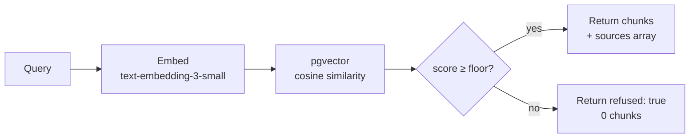

# Anchor

[](https://github.com/ykstorm/anchor/actions/workflows/ci.yml)
[](https://github.com/ykstorm/anchor/actions)
[](LICENSE)
[](tsconfig.json)
[](package.json)
[](CONTRIBUTING.md)

**Provenance-first RAG that refuses to hallucinate.**

One sentence: a retrieval layer that returns a grounded answer when similarity is high, and explicitly refuses when it isn't — no fabrication, no hedging.

**Live demo:** [anchor-iota-ten.vercel.app](https://anchor-iota-ten.vercel.app)
**Playground:** [anchor-iota-ten.vercel.app/playground](https://anchor-iota-ten.vercel.app/playground)
**Code:** [github.com/ykstorm/anchor](https://github.com/ykstorm/anchor)

---

## The problem

RAG tutorials show the happy path. Production lives in the unhappy path.

A cosine similarity of 0.12 between the query and the closest chunk in your corpus is not a foundation for a confident answer — but most RAG systems feed it to the LLM anyway and get a plausible-sounding fabrication. Anchor treats that signal for what it is: too weak to use.

The fix isn't a better model. It's an honest retrieval layer.

---

## Project layout

```
anchor/
├── src/
│   ├── app/                    # Next.js 15 App Router pages + API routes
│   │   ├── api/
│   │   │   ├── query/          # POST /api/query — retrieval endpoint
│   │   │   ├── chat/           # POST /api/chat — OpenAI chat route
│   │   │   ├── health/         # GET /api/health — readiness probe
│   │   │   └── admin/seed/     # POST /api/admin/seed — corpus seeder
│   │   ├── playground/         # /playground — interactive query UI
│   │   ├── layout.tsx          # root layout (fonts, metadata)
│   │   └── page.tsx            # landing page
│   └── lib/
│       ├── rag/
│       │   ├── retriever.ts    # core retrieval: embed → pgvector → floor filter
│       │   ├── embed-writer.ts # idempotent upsert pipeline per entity type
│       │   ├── demo-seeder.ts  # embeds 16 public-domain projects
│       │   └── seed-runner.ts  # batch seed orchestration
│       └── prisma.ts           # Prisma client singleton
├── prisma/
│   ├── schema.prisma           # Embedding model + pgvector extension
│   └── seed.ts                 # (legacy — use API seeder instead)
├── scripts/
│   ├── embed-backfill.ts       # backfill embeddings from /corpus dir
│   ├── calibrate-floor.ts      # tune cosine floor from query logs
│   └── e2e.ts                  # smoke-test script
├── tests/
│   ├── retriever.test.ts       # 10 unit tests for retrieval logic
│   └── embed-writer.test.ts    # 5 unit tests for embed pipeline
├── docs/
│   └── architecture.md         # full system architecture + sequence diagrams
├── docker-compose.yml          # Postgres + pgvector + app for local dev
├── Dockerfile                  # multi-stage production image
├── .env.example                # required env vars
├── SPEC.md                     # feature inventory + verified code locations
├── INTERVIEW_REPORT.md         # design decisions + "for the interview" notes
├── CHANGELOG.md                # version history
├── DEPLOY.md                   # local / Vercel+Neon / self-hosted guides
└── CONTRIBUTING.md             # (created in this polish pass)
```

## Architecture overview



- **Cosine floor.** Configurable threshold (default 0.30). Below it → empty result, explicit refusal.
- **Adaptive K.** Precision queries get K=6, recall queries get K=10. Different information needs, different parameters.
- **Provenance.** Every chunk carries its `sourceId`. The API response includes a structured `sources[]` array.

---

## Live demo

```bash
# Refused state — query with no corpus match
curl -X POST https://anchor-iota-ten.vercel.app/api/query \
  -H "Content-Type: application/json" \
  -d '{"q":"xkcd 18472 nonsense gibberish"}'
# → {"chunks":[],"refused":true}

# Grounded state — query matching the demo corpus
curl -X POST https://anchor-iota-ten.vercel.app/api/query \
  -H "Content-Type: application/json" \
  -d '{"q":"What does Anchor do when retrieval fails?"}'
# → {"chunks":[...],"refused":false}
```

Playground at [anchor-iota-ten.vercel.app/playground](https://anchor-iota-ten.vercel.app/playground) — paste any query, see chunk scores and source badges.

---

## Stack

| Layer | Choice |
|---|---|
| Vector DB | Postgres + pgvector |
| ORM | Prisma 7 |
| API | Next.js 15 (App Router) |
| Embeddings | OpenAI `text-embedding-3-small` |
| Deploy | Vercel |
| License | Apache 2.0 |

~970 LOC. No framework, no managed service.

---

## Known limitations

- **No LLM generation.** This is retrieval-only. The API returns chunks or a refusal. Wire it to your model's system prompt yourself.
- **Small demo corpus.** 16 projects, 5 builders, 4 localities, 4 infra categories, 30 location items. Not 100k+ documents.
- **Single-stage retrieval.** No re-ranking, no hybrid BM25, no ensemble. The `afterRetrieve(chunks)` hook is exposed for adding your own.
- **No multi-tenancy.** Single-tenant Postgres schema. Namespace per tenant is on the v0.3 roadmap.

---

## Try locally

```bash
git clone https://github.com/ykstorm/anchor.git
cd anchor

# 1. Set env
cp .env.example .env
# Add OPENAI_API_KEY, DATABASE_URL

# 2. Install + migrate
npm install
npx prisma migrate dev

# 3. Seed the demo corpus
npx tsx prisma/seed.ts

# 4. Start
npm run dev
```

---

## License

Apache 2.0 — see [LICENSE](LICENSE).
