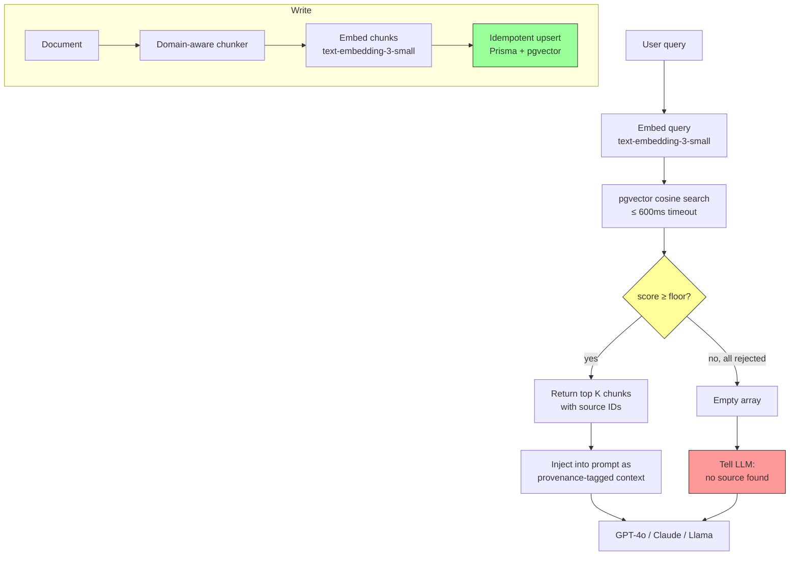

# Anchor

**RAG that refuses to hallucinate. Provenance-first retrieval, opinionated about failure.**

[](https://github.com/ykstorm/anchor/actions/workflows/ci.yml)
[](https://hub.docker.com/r/ykstorm/anchor)
[](LICENSE)
[](https://anchor.lakshyaraj.dev)

Live: **[anchor.lakshyaraj.dev](https://anchor.lakshyaraj.dev)**

---

## How this started

RAG tutorials show the happy path. Production is where the unhappy path lives. Anchor is the retrieval layer I built to handle the unhappy path well. The cosine floor, adaptive K, and idempotent upsert patterns are extracted from homesty.ai's production retrieval stack.

---

## What Anchor does

A retriever with three opinions:

**1. Cosine floor.** No chunk crosses 0.30 (configurable per corpus)? Return an empty array. The LLM is told there is no source and the response template is a defer, not a fabrication. The unhappy path is engineered, not implicit.

**2. Adaptive K per query intent.** A query like "schedule of payments for Goyal Aspire" wants precision. "Schools near Bopal" wants recall. Anchor classifies intent before retrieving — K=6 with floor 0.30 for precision queries, K=10 with floor 0.20 for recall queries. Different information needs, different parameters.

**3. Provenance first.** Every chunk carries its `sourceId` through the pipeline. The system prompt sees `chunk 3 from sourceId proj-goyal-aspire`. When the model cites, it cites by ID — and the API returns a structured `sources: []` array. No "based on my training data" smuggling.

Plus two safety bets:

- **600 ms retrieval timeout.** pgvector is fast but cold connections happen. Anchor wraps retrieval — if it takes longer, the function returns an empty array. Slow degradation, not a 30-second silent stall.
- **Idempotent upsert.** Re-running the seed script doesn't double your embedding bill. Each chunk is keyed by `(documentId, position, contentHash)`. Same content → same row.

---

## When to use Anchor and when not to

| You want this | Use |
|---|---|
| A retrieval layer that's opinionated about when to lie | Anchor |
| A retrieval layer + agent framework + tools + chains + everything | LangChain |
| A retrieval layer + indexing UI + dashboard | LlamaIndex |
| A managed vector DB with no infra to run | Pinecone, Weaviate |
| A retrieval layer + classical search + BM25 hybrid out of the box | Vespa |

Anchor is small. ~970 LOC. Postgres + pgvector + OpenAI embeddings + the three opinions above. If you want a framework, this isn't one. If you want a managed service, this isn't one either.

I built it because I needed retrieval that fails correctly, not retrieval that ships with a UI and a billing page.

---

## 60-second quickstart

```bash
git clone https://github.com/ykstorm/anchor && cd anchor
cp .env.example .env                # paste your OPENAI_API_KEY
docker compose up -d                # postgres + pgvector + the app
docker compose exec app npm run seed   # ~30s, embeds 10 public-domain docs
open http://localhost:3000/playground
```

That's it. The playground UI lets you fire queries against the seed corpus. Try one that should work ("what does Anchor do when retrieval fails?") and one that shouldn't ("xkcd 18472 random gibberish"). Watch the cosine floor reject the second one.

For a clean teardown: `docker compose down -v`.

---

## Architecture



Full architecture doc with sequence diagrams: [docs/architecture.md](docs/architecture.md).

---

## Why 0.30

It's not arbitrary. I ran retrieval on production query logs from week one of homesty.ai and bucketed the cosine scores by whether the chunk was on-topic (human-judged). The histogram had a clear break at ~0.28. I set the floor at 0.30 with some margin. Above that line: usually relevant. Below: usually noise.

The amenity-query exception (0.20) came from the same exercise on amenity queries specifically. School/hospital/mall queries have lower vector similarity but still useful chunks — buyers want to see options, not be told there are none.

If your domain isn't real estate, re-derive for your own corpus:
```bash
npm run calibrate -- --corpus=./your-corpus.jsonl
```

The script does the same histogram + suggests a floor.

---

## What I'd build differently next time

- **Add MMR re-ranking from day one.** Top-K can be redundant (six chunks all saying nearly the same thing). MMR diversifies. v0.2 will ship it.
- **Hybrid retrieval for proper nouns.** Pure vector search struggles when the query contains a builder name not in the corpus vocabulary. Hybrid (BM25 + vector) handles this. v0.3.
- **Don't lock to OpenAI embeddings at v0.1.** I should have shipped Anthropic/Voyage/Cohere/Ollama adapters from day one. v0.2 lands them. Until then, see `src/lib/rag/embedder.ts` for the interface to swap.

If you start a RAG project today using this template, add those three things to your sprint plan.

---

## Roadmap

- [x] v0.1 — cosine floor, adaptive K, provenance API, 600ms timeout, idempotent upsert
- [ ] v0.2 — MMR re-ranking, Anthropic/Voyage/Ollama embedder adapters
- [ ] v0.3 — hybrid retrieval (BM25 + vector), multi-tenant schema
- [ ] v0.4 — observability hooks (OTel) that don't lock you into one vendor

Not on the roadmap: agentic query rewriting, automatic re-embedding on schema change. Anchor stays a retrieval layer.

---

## Tests + CI

```bash
npm test          # 15 tests
npm run build     # Next standalone build
docker compose up # full e2e
```

CI runs lint → unit tests → docker build → e2e against compose stack on every PR.

---

## Limits — what Anchor won't do

- Postgres only. Not Pinecone, not Weaviate. By design.
- OpenAI embeddings only at v0.1.
- English-tuned defaults — the 0.30 floor was derived on English real-estate queries. Recalibrate for your corpus.
- No built-in re-ranker. We expose hooks; you bring your own cross-encoder if you need one.

If any of those are dealbreakers, use a different tool. I'd rather Anchor be small and honest than a framework that tries to do everything.

---

## License

Apache License 2.0 — see [LICENSE](LICENSE).

## Provenance

Extracted from the retrieval layer of [homesty.ai](https://homesty.ai), a production real-estate AI advisor running live commission traffic in Mumbai. The cosine floor, adaptive K, and provenance patterns were forged against eight production fabrication classes — all closed.

## Author

**Lakshyaraj Singh Rao** — Full-Stack Engineer · AI Systems · Backend · DevOps
Mumbai, India

[lakshyaraj.dev](https://lakshyaraj.dev) · [@ykstorm](https://github.com/ykstorm) · [LinkedIn](https://linkedin.com/in/lakshyaraj) · raolakshyaraj@gmail.com
