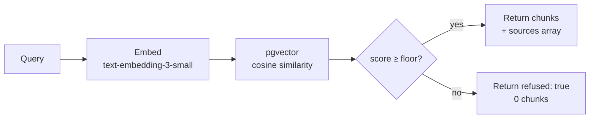

# Anchor

**Provenance-first RAG that refuses to hallucinate.**

One sentence: a retrieval layer that returns a grounded answer when similarity is high, and explicitly refuses when it isn't — no fabrication, no hedging.

**Live demo:** [anchor-iota-ten.vercel.app](https://anchor-iota-ten.vercel.app)
**Playground:** [anchor-iota-ten.vercel.app/playground](https://anchor-iota-ten.vercel.app/playground)
**Code:** [github.com/ykstorm/anchor](https://github.com/ykstorm/anchor)

---

## The problem

RAG tutorials show the happy path. Production lives in the unhappy path.

A cosine similarity of 0.12 between the query and the closest chunk in your corpus is not a foundation for a confident answer — but most RAG systems feed it to the LLM anyway and get a plausible-sounding fabrication. Anchor treats that signal for what it is: too weak to use.

The fix isn't a better model. It's an honest retrieval layer.

---

## How it works



- **Cosine floor.** Configurable threshold (default 0.30). Below it → empty result, explicit refusal.
- **Adaptive K.** Precision queries get K=6, recall queries get K=10. Different information needs, different parameters.
- **Provenance.** Every chunk carries its `sourceId`. The API response includes a structured `sources[]` array.

---

## Live demo

```bash
# Refused state — query with no corpus match
curl -X POST https://anchor-iota-ten.vercel.app/api/query \
  -H "Content-Type: application/json" \
  -d '{"q":"xkcd 18472 nonsense gibberish"}'
# → {"chunks":[],"refused":true}

# Grounded state — query matching the demo corpus
curl -X POST https://anchor-iota-ten.vercel.app/api/query \
  -H "Content-Type: application/json" \
  -d '{"q":"What does Anchor do when retrieval fails?"}'
# → {"chunks":[...],"refused":false}
```

Playground at [anchor-iota-ten.vercel.app/playground](https://anchor-iota-ten.vercel.app/playground) — paste any query, see chunk scores and source badges.

---

## Stack

| Layer | Choice |
|---|---|
| Vector DB | Postgres + pgvector |
| ORM | Prisma 7 |
| API | Next.js 15 (App Router) |
| Embeddings | OpenAI `text-embedding-3-small` |
| Deploy | Vercel |
| License | Apache 2.0 |

~970 LOC. No framework, no managed service.

---

## What's NOT here

- **No LLM generation.** This is retrieval-only. The API returns chunks or a refusal. Wire it to your model's system prompt yourself.
- **Demo corpus is small.** 16 projects, 5 builders, 4 localities, 4 infra categories, 30 location items. Not 100k+ documents.
- **Single-stage retrieval.** No reranking, no hybrid BM25, no ensemble.

---

## Try locally

```bash
git clone https://github.com/ykstorm/anchor.git
cd anchor

# 1. Set env
cp .env.example .env
# Add OPENAI_API_KEY, DATABASE_URL

# 2. Install + migrate
npm install
npx prisma migrate dev

# 3. Seed the demo corpus
npx tsx prisma/seed.ts

# 4. Start
npm run dev
```

---

## License

Apache 2.0 — see [LICENSE](LICENSE).
