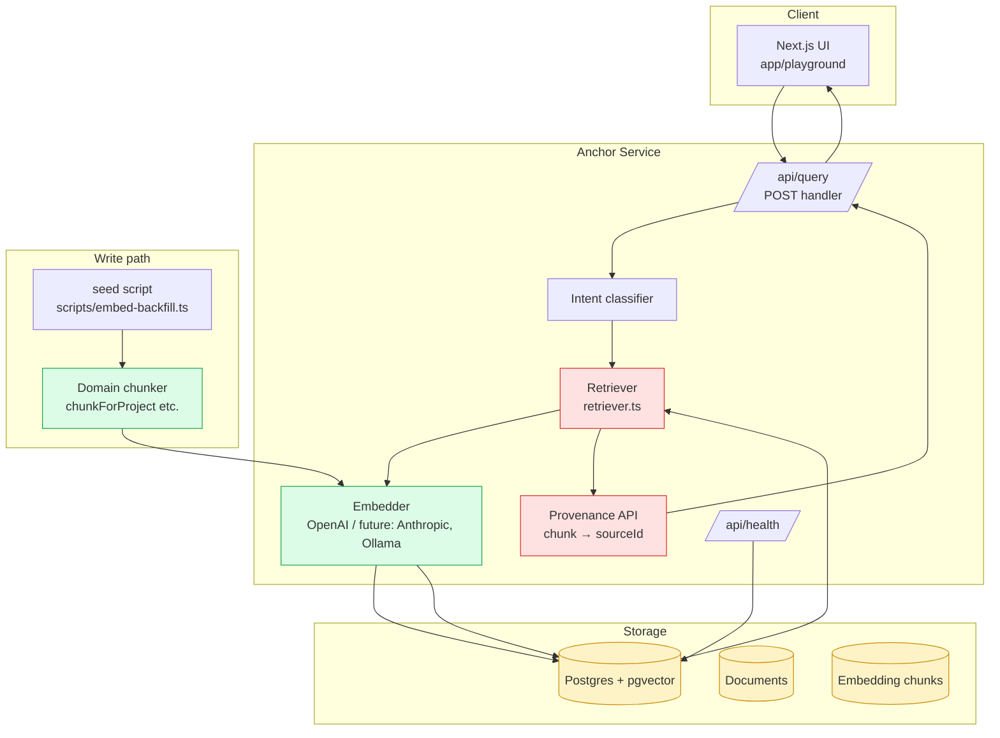
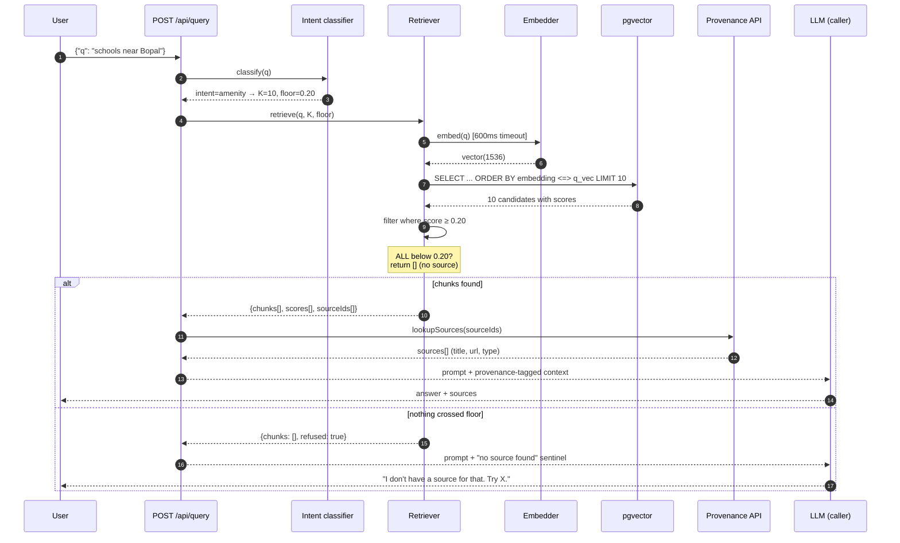
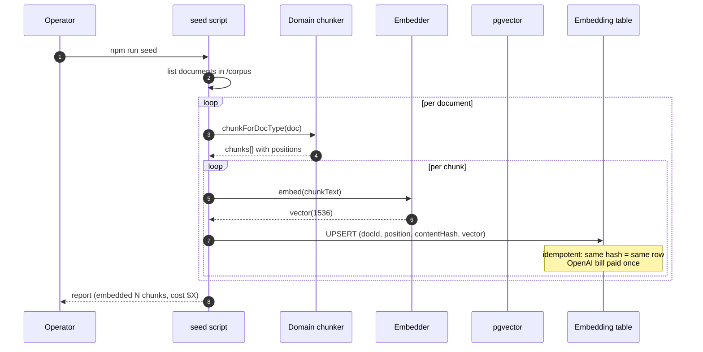
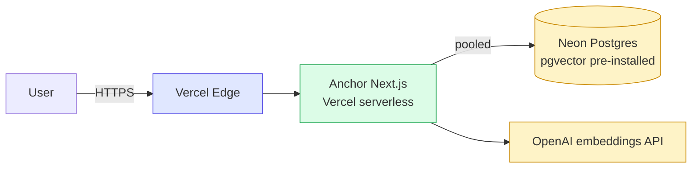

# Anchor — System Architecture

## Why this document exists

Most "RAG system" diagrams are happy-path arrows: query → embed → search → answer. They hide where things go wrong. This doc traces both paths — happy and unhappy — and shows where each defensive layer earns its keep.

---

## 1. Component map

---

## 2. Read path — query sequence

**Why the sentinel matters.** The LLM is not free-running. It is told explicitly: when `chunks: []` and `refused: true`, do not synthesize from priors. Defer to a fallback action (ask clarifying question, suggest documentation link, suggest contacting human). This is the difference between Anchor and a naive top-K retriever — the unhappy path is engineered, not implicit.

---

## 3. Write path — document ingestion

---

## 4. The five defensive layers

Inherited from the buyerchat anti-fabrication architecture, three of them land in Anchor:

| # | Layer | Where it lives | What it catches |
|---|---|---|---|
| 1 | Cosine floor | `retriever.ts:filterByFloor` | Top-K results that are technically returned but semantically irrelevant |
| 2 | 600 ms timeout | `retriever.ts:withTimeout` | Slow embedder or DB → silent degradation, not 30s hang |
| 3 | Provenance API | `lib/provenance.ts` | LLM citation drift — chunk goes in, sourceId must come out |
| 4 | Adaptive K | `retriever.ts:classifyIntent` | Amenity queries starved of recall; precision queries flooded with noise |
| 5 | Idempotent upsert | `scripts/embed-backfill.ts` | Re-seed bloats the table, doubles cost, confuses retrieval |

Layers 2 (markdown abort) and 4 (regex audit) from buyerchat live in a sibling project: **Streamward**.

---

## 5. Failure modes (intentional)

| Failure | Anchor behavior | What you DON'T get |
|---|---|---|
| Embedder timeout (>600ms) | Returns empty chunks + `refused: true` | A 30s hang while OpenAI is having an outage |
| All chunks below floor | Returns empty chunks + `refused: true` | The LLM stitching together unrelated documents |
| DB connection drop | Returns empty chunks + Sentry alert | A crashing API route |
| Malformed query (empty string) | 400 Bad Request | A wasted embedding call |
| Duplicate seed run | Idempotent — same hash → same row | Doubled embedding cost + duplicate retrieval hits |

---

## 6. What's intentionally out of scope (v0.1)

- **Re-ranking.** Cross-encoder re-rank pass would improve quality at the cost of latency. We expose a hook (`afterRetrieve(chunks)`) but ship without one. Add yours if you need it.
- **Hybrid retrieval (BM25 + vector).** Proper nouns hurt pure vector search. Hybrid retrieval is on the v0.3 roadmap.
- **Multi-tenant isolation.** Single-tenant Postgres schema. v0.3 adds namespace per tenant.
- **Streaming.** Anchor returns chunks synchronously. Streaming the LLM response is the caller's job (Anchor's sibling **Streamward** handles mid-stream safety).

---

## 7. Deployment topology (production)

- **Compute:** Vercel Next.js serverless functions (no cold-start tax on Edge runtime for /api/query)
- **Database:** Neon Postgres (Free tier supports pgvector natively, autoscaling, branching for preview deploys)
- **Embedder:** OpenAI text-embedding-3-small (~$0.02 per million tokens, sub-200ms p99)
- **Observability:** Sentry for errors, Vercel Analytics for latency, OpenTelemetry hooks exposed but unopinionated

Self-hosted alternative: any Postgres with pgvector + any Node runtime. Anchor is portable by design.
