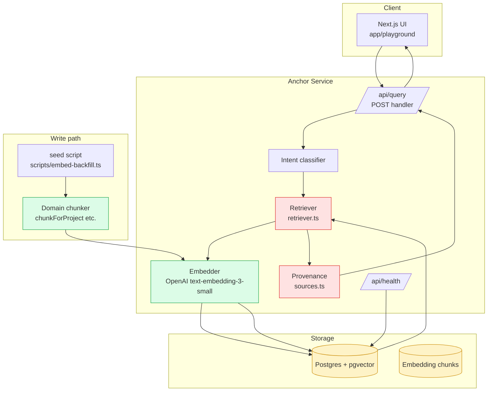
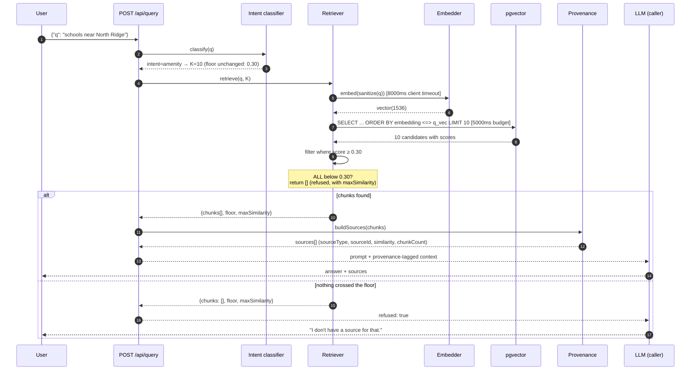
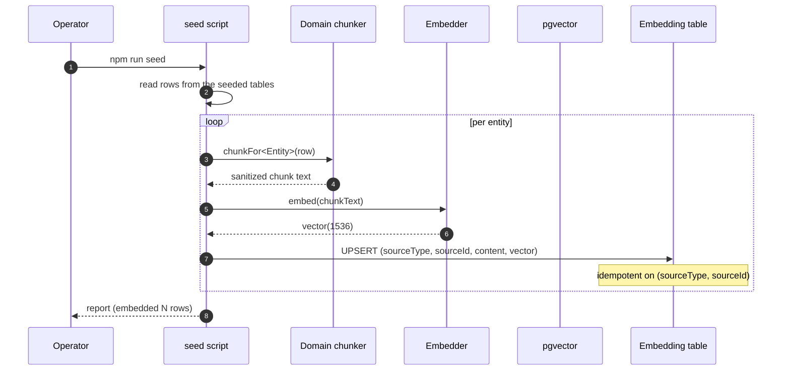
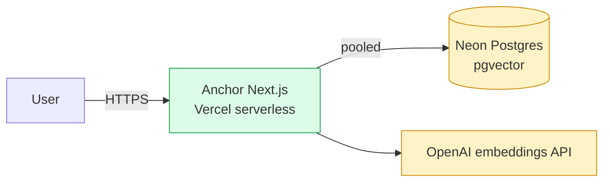

# Anchor — System Architecture

## Why this document exists

Most "RAG system" diagrams are happy-path arrows: query → embed → search →
answer. They hide where things go wrong. This doc traces both paths — the match
and the miss — and shows where each check earns its keep.

---

## 1. Component map

```mermaid
graph TB
    subgraph Client
        UI[Next.js UI<br/>app/playground]
    end

    subgraph "Anchor Service"
        API[/api/query<br/>POST handler/]
        Intent[Intent classifier]
        Retriever[Retriever<br/>retriever.ts]
        Embedder[Embedder<br/>OpenAI text-embedding-3-small]
        Provenance[Provenance<br/>sources.ts]
        Health[/api/health/]
    end

    subgraph Storage
        PG[(Postgres + pgvector)]
        Chunks[(Embedding chunks)]
    end

    subgraph "Write path"
        Seed[seed script<br/>scripts/embed-backfill.ts]
        Chunker[Domain chunker<br/>chunkForProject etc.]
    end

    UI --> API
    API --> Intent
    Intent --> Retriever
    Retriever --> Embedder
    Embedder --> PG
    PG --> Retriever
    Retriever --> Provenance
    Provenance --> API
    API --> UI

    Seed --> Chunker
    Chunker --> Embedder
    Embedder --> PG

    Health --> PG

    classDef storage fill:#fef3c7,stroke:#ca8a04
    classDef defense fill:#fee2e2,stroke:#dc2626
    classDef happy fill:#dcfce7,stroke:#16a34a

    class PG,Chunks storage
    class Retriever,Provenance defense
    class Embedder,Chunker happy
```

---

## 2. Read path — query sequence

```mermaid
sequenceDiagram
    autonumber
    participant U as User
    participant API as POST /api/query
    participant I as Intent classifier
    participant R as Retriever
    participant E as Embedder
    participant V as pgvector
    participant P as Provenance
    participant L as LLM (caller)

    U->>API: {"q": "schools near North Ridge"}
    API->>I: classify(q)
    I-->>API: intent=amenity → K=10 (floor unchanged: 0.30)
    API->>R: retrieve(q, K)
    R->>E: embed(sanitize(q))  [8000ms client timeout]
    E-->>R: vector(1536)
    R->>V: SELECT ... ORDER BY embedding <=> q_vec LIMIT 10  [5000ms budget]
    V-->>R: 10 candidates with scores
    R->>R: filter where score ≥ 0.30
    Note over R: ALL below 0.30?<br/>return [] (refused, with maxSimilarity)

    alt chunks found
        R-->>API: {chunks[], floor, maxSimilarity}
        API->>P: buildSources(chunks)
        P-->>API: sources[]  (sourceType, sourceId, similarity, chunkCount)
        API-->>L: prompt + provenance-tagged context
        L-->>U: answer + sources
    else nothing crossed the floor
        R-->>API: {chunks: [], floor, maxSimilarity}
        API-->>L: refused: true
        L-->>U: "I don't have a source for that."
    end
```

**Why the no-answer path matters.** When `chunks: []` and `refused: true`, the
caller must not synthesize from priors — it should fall back (ask a clarifying
question, point to documentation, hand off to a human). That engineered miss is
the difference between Anchor and a naive top-K retriever. A failure, by contrast,
is not a miss: an embedding or DB error raises `RetrievalError` and the route
returns 503, so the caller never mistakes a broken dependency for "no answer".

---

## 3. Write path — document ingestion

```mermaid
sequenceDiagram
    autonumber
    participant Op as Operator
    participant Seed as seed script
    participant Chunk as Domain chunker
    participant E as Embedder
    participant V as pgvector
    participant L as Embedding table

    Op->>Seed: npm run seed
    Seed->>Seed: read rows from the seeded tables
    loop per entity
        Seed->>Chunk: chunkFor<Entity>(row)
        Chunk-->>Seed: sanitized chunk text
        Seed->>E: embed(chunkText)
        E-->>Seed: vector(1536)
        Seed->>L: UPSERT (sourceType, sourceId, content, vector)
        Note over L: idempotent on (sourceType, sourceId)
    end
    Seed-->>Op: report (embedded N rows)
```

---

## 4. The checks that make a miss safe

Three checks, all in this repo:

| # | Check | Where it lives | What it catches |
|---|---|---|---|
| 1 | Cosine floor | `retriever.ts` (`SIM_FLOOR` filter) | Top-K results that are returned but too weak to answer from |
| 2 | Failure ≠ refusal | `retriever.ts` (`RetrievalError`) → `api/query` 503 | A broken embedder/DB reported as a false "no answer" |
| 3 | Provenance | `sources.ts` (`buildSources`) | A chunk going in without a named source coming out |

The floor is never lowered by the query text — amenity queries widen K and boost
on-topic location rows, but a weak match stays a refusal.

---

## 5. Failure modes (intentional)

| Situation | Anchor behavior |
|---|---|
| All candidates below the floor | Empty chunks + `refused: true` + `maxSimilarity` reported |
| DB query exceeds the 5000ms budget | `RetrievalError` → 503 (not a refusal) |
| Embedding call fails | `RetrievalError` → 503 (not a refusal) |
| DB connection drops | `RetrievalError` → 503; error logged server-side |
| Malformed request (bad JSON, empty `q`, non-JSON body, foreign Origin) | 400 / 415 / 403 before any embedding call |
| Too many requests | 429 + `Retry-After` (20/min per caller, 1000/hr global) |
| Duplicate seed run | Idempotent upsert on `(sourceType, sourceId)` |

---

## 6. What's intentionally out of scope (v0.1)

- **Re-ranking.** A cross-encoder rerank pass would improve quality at a latency cost. Not shipped.
- **Hybrid retrieval (BM25 + vector).** Proper nouns hurt pure vector search; hybrid is future work.
- **Multi-tenant isolation.** Single-tenant Postgres schema; there is no per-tenant namespace.
- **Streaming.** Anchor returns chunks synchronously. Streaming a model response is the caller's job.

---

## 7. Deployment topology (production)

```mermaid
graph LR
    User[User] -->|HTTPS| App[Anchor Next.js<br/>Vercel serverless]
    App -->|pooled| Neon[(Neon Postgres<br/>pgvector)]
    App --> OpenAI[OpenAI embeddings API]

    classDef compute fill:#dcfce7,stroke:#16a34a
    classDef data fill:#fef3c7,stroke:#ca8a04

    class App compute
    class Neon,OpenAI data
```

- **Compute:** Vercel serverless functions (Node runtime).
- **Database:** Neon Postgres (free tier supports pgvector, with branching for preview deploys).
- **Embedder:** OpenAI text-embedding-3-small (~$0.02 per million tokens; latency depends on load).
- **Observability:** Vercel Analytics for page latency (query strings stripped before send).

Self-hosted alternative: any Postgres with pgvector + any Node runtime.
